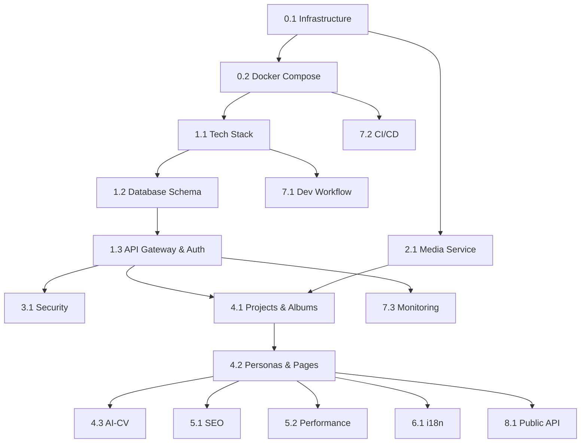

# Матрица трассируемости требований Venus

Документ связывает требования из [`manifest.md`](manifest.md) с конкретными этапами реализации в [`stages.md`](stages.md) и обеспечивает контроль полноты покрытия.

---

## Содержание

1. [Структура матрицы](#структура-матрицы)
2. [Проблемы и решения](#проблемы-и-решения-раздел-3-манифеста)
3. [Архитектура и сущности](#архитектура-и-сущности-раздел-5-манифеста)
4. [Принципы Venus](#принципы-venus-раздел-7-манифеста)
5. [Контрольные точки](#контрольные-точки-раздел-77-манифеста)
6. [Статус-трекер](#статус-трекер-по-этапам)
7. [Метрики покрытия](#метрики-покрытия)

---

## Структура матрицы

Каждое требование отслеживается через:
- 📋 **Требование** — функциональность из манифеста
- 🔢 **Этап реализации** — номер этапа в stages.md
- ✅ **Статус** — текущее состояние
- 📦 **Артефакты** — код, конфигурации, документация
- 🧪 **Верификация** — критерии приёмки

**Статусы:**
- ⏳ **Planned** — запланировано
- 🚧 **In Progress** — в работе
- ✅ **Done** — реализовано и верифицировано
- ❌ **Blocked** — заблокировано зависимостями
- ⚠️ **At Risk** — под угрозой срыва

---

## Проблемы и решения (Раздел 3 манифеста)

### Двойная и тройная работа над проектами

| ID | Проблема | Решение в Venus | Этап | Статус | Верификация |
|----|----------|-----------------|------|--------|-------------|
| PROB-001 | Ручная переупаковка проектов в кейсы | Проект сразу создаётся как альбом | 4.1 | ⏳ | Один проект = готовый альбом без редизайна |
| PROB-002 | Дублирование контента | Недеструктивные плейсхолдеры | 4.1 | ⏳ | Изменение representation не дублирует данные |
| PROB-003 | Несогласованные версии | Single source of truth в БД | 1.2 | ⏳ | Изменение проекта сразу отражается везде |

### Портфолио отстаёт от реальности

| ID | Проблема | Решение в Venus | Этап | Статус | Верификация |
|----|----------|-----------------|------|--------|-------------|
| PROB-004 | Портфолио в хаосе папок и ссылок | Централизованная платформа | 1.2, 2.1 | ⏳ | Все проекты в одном workspace |
| PROB-005 | "Сделать портфолио когда-нибудь" | Проекты создаются сразу в публичном формате | 4.1, 4.2 | ⏳ | Draft → Published в один клик |
| PROB-006 | Обновление = отдельный проект | Continuous publishing | 4.2 | ⏳ | Изменения публикуются автоматически (ISR) |

### Много ролей — одна витрина

| ID | Проблема | Решение в Venus | Этап | Статус | Верификация |
|----|----------|-----------------|------|--------|-------------|
| PROB-007 | Смешивание всех ролей в один профиль | Множественные персоны | 4.2 | ⏳ | Один аккаунт → несколько independent персон |
| PROB-008 | Невозможность разделить аудитории | Каждая персона = отдельный URL | 4.2 | ⏳ | `/@designer` и `/@developer` независимы |

### Нет универсальной структуры

| ID | Проблема | Решение в Venus | Этап | Статус | Верификация |
|----|----------|-----------------|------|--------|-------------|
| PROB-009 | Каждая профессия описывает проекты по-разному | Универсальные плейсхолдеры | 4.1 | ⏳ | Один набор плейсхолдеров для всех профессий |
| PROB-010 | Изобретение своей "книжки" с нуля | Готовая структура альбома | 4.1 | ⏳ | Template плейсхолдеров из коробки |

---

## Архитектура и сущности (Раздел 5 манифеста)

### 5.1. Аккаунт

| ID | Требование | Реализация | Этап | Статус | Артефакты |
|----|-----------|-----------|------|--------|-----------|
| ENT-001 | Приватная сущность владельца | `accounts` table в PostgreSQL | 1.2 | ⏳ | `infrastructure/postgres/schema.sql` |
| ENT-002 | Логин, пароль, настройки | Auth Service | 1.3 | ⏳ | `services/auth-service/` |
| ENT-003 | Никогда не в открытом доступе | Privacy by design | 3.1 | ⏳ | Email не показывается публично |
| ENT-004 | Множественные персоны под аккаунтом | One-to-many relation | 1.2 | ⏳ | `personas.account_id` foreign key |
| ENT-005 | Хранение всех проектов и CV | Account-owned resources | 1.2 | ⏳ | `projects.account_id`, `cv_generations.account_id` |

### 5.2. Персона

| ID | Требование | Реализация | Этап | Статус | Артефакты |
|----|-----------|-----------|------|--------|-----------|
| ENT-006 | Публичная "личность" автора | `personas` table | 1.2 | ⏳ | `services/persona-service/` |
| ENT-007 | Разные имена/никнеймы | `display_name` field | 4.2 | ⏳ | Persona settings |
| ENT-008 | Разные наборы проектов | `persona_projects` junction table | 1.2 | ⏳ | Many-to-many relationship |
| ENT-009 | Разные манифесты | `manifest` TEXT field | 4.2 | ⏳ | Rich text editor |
| ENT-010 | Уникальный URL slug | `slug` VARCHAR UNIQUE | 1.2, 5.1 | ⏳ | `/@{persona-slug}` routing |

### 5.3. Проект-альбом

| ID | Требование | Реализация | Этап | Статус | Артефакты |
|----|-----------|-----------|------|--------|-----------|
| ENT-011 | Альбом вместо карточки | JSONB структура с плейсхолдерами | 4.1 | ⏳ | `projects.content` JSONB |
| ENT-012 | Последовательность разворотов | Ordered placeholders array | 4.1 | ⏳ | `order` field в каждом placeholder |
| ENT-013 | Модульные плейсхолдеры | Система типов плейсхолдеров | 4.1 | ⏳ | 9 базовых типов (cover, meta, process, etc.) |
| ENT-014 | Универсальность для профессий | Generic placeholder system | 4.1 | ⏳ | Одна система для всех |
| ENT-015 | Включение/отключение модулей | `enabled` flag на плейсхолдерах | 4.1 | ⏳ | Drag-and-drop reordering |
| ENT-016 | Изменение порядка | Reorder без data loss | 4.1 | ⏳ | Недеструктивность гарантирована |

### 5.4. Main-проект

| ID | Требование | Реализация | Этап | Статус | Артефакты |
|----|-----------|-----------|------|--------|-----------|
| ENT-017 | Главный мета-проект персоны | Project type = "main-project" | 4.2 | ⏳ | `projects.type` field |
| ENT-018 | Один main-проект на персону | Business logic constraint | 4.2 | ⏳ | Validation в persona-service |
| ENT-019 | Ссылки на проекты без дублей | Reference через IDs | 4.2 | ⏳ | `references` array в content |
| ENT-020 | Автоматическое обновление при изменении источника | Reactive queries | 4.2 | ⏳ | ISR + database triggers |

### 5.5. Публичная страница персоны

| ID | Требование | Реализация | Этап | Статус | Артефакты |
|----|-----------|-----------|------|--------|-----------|
| ENT-021 | Крупная типографика | Editorial design system | 4.2 | ⏳ | Tailwind config + custom fonts |
| ENT-022 | Личный манифест | Manifest text block | 4.2 | ⏳ | `personas.manifest` field |
| ENT-023 | Сетка проектов | Grid layout | 4.2 | ⏳ | Masonry/Grid CSS |
| ENT-024 | Управление видимостью | `persona_projects.is_visible` | 4.2 | ⏳ | Toggle в UI |
| ENT-025 | Управление порядком | `persona_projects.display_order` | 4.2 | ⏳ | Drag-and-drop |
| ENT-026 | Main-проект как Featured | Special rendering | 4.2 | ⏳ | Featured section на странице |
| ENT-027 | Кнопка "Написать автору" | Contact method | 4.2 | ⏳ | Email/form/messenger integration |
| ENT-028 | Скрытый аккаунт | Secure layer | 3.1 | ⏳ | Email не в публичном API |

### 5.6. Рабочее пространство

| ID | Требование | Реализация | Этап | Статус | Артефакты |
|----|-----------|-----------|------|--------|-----------|
| ENT-029 | Workspace для всех проектов | Dashboard UI | 4.1 | ⏳ | `/dashboard` route |
| ENT-030 | Черновики и опубликованные | `projects.status` field | 4.1 | ⏳ | draft/published states |
| ENT-031 | Принадлежность к персонам | Many-to-many assignment | 4.2 | ⏳ | `persona_projects` table |
| ENT-032 | Настройка видимости | Per-persona visibility toggle | 4.2 | ⏳ | UI controls |
| ENT-033 | Настройка порядка | Per-persona ordering | 4.2 | ⏳ | Drag-and-drop |

### 5.7. AI-CV

| ID | Требование | Реализация | Этап | Статус | Артефакты |
|----|-----------|-----------|------|--------|-----------|
| ENT-034 | Автоматическая генерация | AI processing service | 4.3 | ⏳ | `services/ai-cv-service/` |
| ENT-035 | Анализ аккаунта, персон, проектов | Data aggregation | 4.3 | ⏳ | Structured data extractor |
| ENT-036 | Не публикуется открыто | Private resource | 3.1 | ⏳ | Auth required для access |
| ENT-037 | Генерация по запросу | API endpoint | 4.3 | ⏳ | `POST /api/cv/generate` |
| ENT-038 | PDF формат | PDF generation | 4.3 | ⏳ | Puppeteer/React-PDF |
| ENT-039 | Скачивание и отправка | File delivery | 4.3 | ⏳ | Expiring URLs |

---

## Опыт и цели (Раздел 6 манифеста)

### 6.1. Для авторов

| ID | Цель | Реализация | Этап | Статус | Верификация |
|----|------|-----------|------|--------|-------------|
| UX-001 | Несколько портфолио под один аккаунт | Multi-persona architecture | 4.2 | ⏳ | User может создать 5+ персон |
| UX-002 | Альбомы-книги вместо карточек | Placeholder system | 4.1 | ⏳ | Проект = структурированный альбом |
| UX-003 | Личный манифест для персоны | Manifest editor | 4.2 | ⏳ | Rich text editing + preview |
| UX-004 | Управление видимостью проектов | Visibility controls | 4.2 | ⏳ | Show/hide per persona |
| UX-005 | Управление порядком проектов | Ordering controls | 4.2 | ⏳ | Drag-and-drop reordering |
| UX-006 | CV одной кнопкой | One-click CV generation | 4.3 | ⏳ | "Generate CV" button → PDF |

### 6.2. Для зрителей

| ID | Цель | Реализация | Этап | Статус | Верификация |
|----|------|-----------|------|--------|-------------|
| UX-007 | Понимание роли автора | Четкая презентация персоны | 4.2 | ⏳ | Manifest видим сразу |
| UX-008 | Премиальная подача | Editorial design | 4.2 | ⏳ | Visual quality assessment |
| UX-009 | Быстрое составление ощущения | Manifest + grid view | 4.2 | ⏳ | Информация доступна без скроллинга |
| UX-010 | Быстрая связь с автором | Contact button | 4.2 | ⏳ | One-click contact initiation |

### 6.3. Для сообщества

| ID | Цель | Реализация | Этап | Статус | Верификация |
|----|------|-----------|------|--------|-------------|
| UX-011 | Свободное развертывание | Open-source + Docker | 0.2, 7.1 | ⏳ | Self-hosted инструкция работает |
| UX-012 | Форк и адаптация | Модульная архитектура | 1.1 | ⏳ | Clear extension points |
| UX-013 | Расширение модулями | Plugin system (future) | - | ⏳ | API для расширений |

---

## Принципы Venus (Раздел 7 манифеста)

### 7.1. Структурный позвоночник

| ID | Сущность | Реализация | Этап | Статус | Артефакты |
|----|---------|-----------|------|--------|-----------|
| PRIN-001 | Аккаунт | `accounts` table | 1.2 | ⏳ | PostgreSQL schema |
| PRIN-002 | Персона | `personas` table | 1.2 | ⏳ | PostgreSQL schema |
| PRIN-003 | Проект-альбом | `projects` table с JSONB | 1.2 | ⏳ | PostgreSQL schema |
| PRIN-004 | Main-проект | Type variant of project | 4.2 | ⏳ | Business logic |
| PRIN-005 | Публичная страница | Next.js route | 4.2 | ⏳ | `/[persona-slug]` |
| PRIN-006 | Рабочее пространство | Dashboard interface | 4.1 | ⏳ | `/dashboard` |
| PRIN-007 | CV как производная | Generated from data | 4.3 | ⏳ | AI CV Service |

### 7.2. Недеструктивный подход

| ID | Принцип | Реализация | Этап | Статус | Верификация |
|----|---------|-----------|------|--------|-------------|
| PRIN-008 | Отмена изменений | Change history (future) | - | ⏳ | Undo/redo functionality |
| PRIN-009 | Верстка не разрушает данные | Separation of data/presentation | 4.1 | ⏳ | Data integrity после UI changes |
| PRIN-010 | Новые фичи без "начать с нуля" | Backward compatible changes | All | ⏳ | Migration scripts |

### 7.3. Прозрачность проекта

| ID | Принцип | Реализация | Этап | Статус | Артефакты |
|----|---------|-----------|------|--------|-----------|
| PRIN-011 | Открытый код | GitHub public repository | - | ⏳ | MIT/Apache license |
| PRIN-012 | Открытая дорожная карта | Public roadmap | - | ⏳ | GitHub Projects |
| PRIN-013 | Документация "что" и "почему" | Comprehensive docs | All | ⏳ | `docs/` directory |
| PRIN-014 | Разделение ядра/эксперимента/модулей | Clear architecture | 1.1 | ⏳ | [`docs/stages.md`](stages.md) |

### 7.4. Модульность

| ID | Компонент | Реализация | Этап | Статус | Артефакты |
|----|----------|-----------|------|--------|-----------|
| PRIN-015 | Ядро сущностей | Core database schema | 1.2 | ⏳ | `accounts`, `personas`, `projects` |
| PRIN-016 | AI-CV модуль | Отдельный сервис | 4.3 | ⏳ | `services/ai-cv-service/` |
| PRIN-017 | Комментарии (future) | Отдельный сервис | - | ⏳ | `services/comment-service/` |
| PRIN-018 | Аналитика (future) | Отдельный сервис | - | ⏳ | `services/analytics-service/` |
| PRIN-019 | Импорты/экспорты | Extension endpoints | 8.1 | ⏳ | Import/Export API |
| PRIN-020 | Новые типы блоков | Pluggable placeholder system | 4.1 | ⏳ | Placeholder type registry |

### 7.5. Определения перед использованием

| ID | Термин | Определение | Использование | Статус |
|----|--------|------------|--------------|--------|
| TERM-001 | Персона | Раздел 2 манифеста | UI, docs, code | ✅ |
| TERM-002 | Проект-альбом | Раздел 2 манифеста | UI, docs, code | ✅ |
| TERM-003 | Main-проект | Раздел 2 манифеста | UI, docs, code | ✅ |
| TERM-004 | Placeholder | Раздел 2 манифеста | UI, docs, code | ✅ |
| TERM-005 | Манифест автора | Раздел 2 манифеста | UI, docs, code | ✅ |

### 7.6. Своевременность выполнения

| ID | Принцип | Применение | Статус |
|----|---------|-----------|--------|
| PRIN-021 | Завершённые итерации | Контрольные точки КТ1-4 | ⏳ |
| PRIN-022 | Маленький рабочий срез > идеальный WIP | MVP-first подход | ⏳ |
| PRIN-023 | Пошаговое развитие | Этапы в stages.md | ⏳ |

### 7.7. Контрольные точки

| ID | Точка | Состояние | Этап | Статус | Критерии приёмки |
|----|-------|----------|------|--------|------------------|
| CP-001 | КТ1: Минимальный MVP | Аккаунт → Персона → Проекты → Страница | 1-4.2 | ⏳ | User может создать и опубликовать портфолио |
| CP-002 | КТ2: Множественные персоны | Multiple personas + main-projects | 4.2 | ⏳ | User может вести 3+ персоны |
| CP-003 | КТ3: Редактор альбомов | Полнофункциональный editor | 4.1 | ⏳ | Drag-and-drop, недеструктивность |
| CP-004 | КТ4: AI-CV | Автоматическая генерация резюме | 4.3 | ⏳ | PDF генерируется из портфолио |

---

## Технические требования

### Безопасность и приватность

| ID | Требование | Реализация | Этап | Статус | Артефакты |
|----|-----------|-----------|------|--------|-----------|
| SEC-001 | Безопасное хранение паролей | Bcrypt hashing | 1.3 | ⏳ | auth-service password handling |
| SEC-002 | Защита от SQL injection | Prisma ORM | 1.2 | ⏳ | Type-safe queries |
| SEC-003 | Защита от XSS | Input sanitization | 3.1 | ⏳ | Zod validation + DOMPurify |
| SEC-004 | HTTPS everywhere | SSL/TLS certificates | 0.1 | ⏳ | Let's Encrypt + force HTTPS |
| SEC-005 | Security headers | Helmet middleware | 3.1 | ⏳ | CSP, X-Frame-Options, etc. |
| SEC-006 | Rate limiting | Per-IP и per-user limits | 1.3, 3.1 | ⏳ | 100 req/min baseline |
| SEC-007 | GDPR compliance | Data export/deletion | 3.1 | ⏳ | `/api/account/export`, `/delete` |
| SEC-008 | Secrets management | Vault/Secrets Manager | 0.1 | ⏳ | No secrets в git |

### Хранение и медиа

| ID | Требование | Реализация | Этап | Статус | Артефакты |
|----|-----------|-----------|------|--------|-----------|
| MED-001 | Image upload | Multipart upload | 2.1 | ⏳ | `services/media-service/` |
| MED-002 | Поддержка JPEG, PNG, WebP, SVG | Format validation | 2.1 | ⏳ | MIME type checking |
| MED-003 | Video support (опционально) | MP4, WebM | 2.1 | ⏳ | Video processing pipeline |
| MED-004 | Max file size limits | 10MB images, 100MB videos | 2.1 | ⏳ | Validation middleware |
| MED-005 | Автоматическая оптимизация | Sharp image processing | 2.1 | ⏳ | Multiple sizes generation |
| MED-006 | CDN delivery | Cloudflare CDN | 2.1 | ⏳ | S3/R2 + CDN URLs |
| MED-007 | Storage quotas | Per-account limits | 2.1 | ⏳ | Quota tracking в БД |

### API и расширяемость

| ID | Требование | Реализация | Этап | Статус | Артефакты |
|----|-----------|-----------|------|--------|-----------|
| API-001 | REST API для external access | Public API endpoints | 8.1 | ⏳ | `/api/public/*` |
| API-002 | API authentication | API keys | 8.1 | ⏳ | Key generation/validation |
| API-003 | API rate limiting | Per-key limits | 8.1 | ⏳ | 100 req/hour free tier |
| API-004 | API documentation | Swagger/OpenAPI | 8.1 | ⏳ | [`docs/api-reference.md`](api-reference.md) |
| API-005 | Webhooks (future) | Event system | - | ⏳ | Webhook delivery service |

### SEO и обнаружимость

| ID | Требование | Реализация | Этап | Статус | Артефакты |
|----|-----------|-----------|------|--------|-----------|
| SEO-001 | Clean URLs | Next.js routing | 5.1 | ⏳ | `/@{slug}`, `/project/{slug}` |
| SEO-002 | Meta tags | Dynamic meta generation | 5.1 | ⏳ | next/head или metadata API |
| SEO-003 | Open Graph | OG tags для social sharing | 5.1 | ⏳ | og:title, og:image, etc. |
| SEO-004 | Schema.org markup | Structured data | 5.1 | ⏳ | Person + CreativeWork schemas |
| SEO-005 | Sitemap | Dynamic sitemap.xml | 5.1 | ⏳ | Auto-generated |
| SEO-006 | robots.txt | Crawling control | 5.1 | ⏳ | Allow all except /dashboard |

### Интернационализация

| ID | Требование | Реализация | Этап | Статус | Артефакты |
|----|-----------|-----------|------|--------|-----------|
| I18N-001 | Multi-language UI | next-intl | 6.1 | ⏳ | `locales/` directory |
| I18N-002 | English + Russian initially | Translation files | 6.1 | ⏳ | `en/` и `ru/` JSON |
| I18N-003 | URL-based language switching | `/en/`, `/ru/` | 6.1 | ⏳ | Next.js i18n routing |
| I18N-004 | hreflang tags | SEO для i18n | 6.1 | ⏳ | Alternate links |

### Performance и оптимизация

| ID | Требование | Реализация | Этап | Статус | Target |
|----|-----------|-----------|------|--------|--------|
| PERF-001 | Fast page load | Next.js optimization | 5.2 | ⏳ | LCP < 2.5s |
| PERF-002 | Image optimization | Next.js Image + WebP/AVIF | 5.2 | ⏳ | Auto-format selection |
| PERF-003 | Code splitting | Dynamic imports | 5.2 | ⏳ | <200KB JavaScript bundle |
| PERF-004 | Database query optimization | Indexes + connection pooling | 5.2 | ⏳ | Query time <50ms p95 |
| PERF-005 | Caching strategy | Redis + CDN | 5.2 | ⏳ | Cache hit rate >80% |
| PERF-006 | CDN для static assets | Cloudflare CDN | 5.2 | ⏳ | Global edge delivery |

### Development и Deployment

| ID | Требование | Реализация | Этап | Статус | Артефакты |
|----|-----------|-----------|------|--------|-----------|
| DEV-001 | Local development setup | Docker Compose dev | 7.1 | ⏳ | `docker-compose.dev.yml` |
| DEV-002 | Hot reload | Nodemon/Next dev | 7.1 | ⏳ | Fast iteration |
| DEV-003 | Testing framework | Jest + Playwright | 7.1 | ⏳ | >80% coverage |
| DEV-004 | CI/CD pipeline | GitHub Actions | 7.2 | ⏳ | `.github/workflows/` |
| DEV-005 | Automated deployment | Stage auto, prod manual | 7.2 | ⏳ | [`docs/ci-cd-pipeline.md`](ci-cd-pipeline.md) |
| DEV-006 | Monitoring | Prometheus + Grafana | 7.3 | ⏳ | `infrastructure/monitoring/` |
| DEV-007 | Error tracking | Sentry integration | 7.3 | ⏳ | Real-time error reporting |

---

## Статус-трекер по этапам

### Этап 0: Инфраструктура

| Подэтап | Название | Статус | Прогресс | Блокеры |
|---------|----------|--------|----------|---------|
| 0.1 | Хостинг и инфраструктура | ⏳ | 0% | Budget и provider selection |
| 0.2 | Docker Compose каркас | ⏳ | 0% | - |

### Этап 1: Технический стек и ядро

| Подэтап | Название | Статус | Прогресс | Блокеры |
|---------|----------|--------|----------|---------|
| 1.1 | Выбор tech stack | ⏳ | 0% | - |
| 1.2 | База данных и схема | ⏳ | 0% | Depends on 1.1 |
| 1.3 | API Gateway & Auth | ⏳ | 0% | Depends on 1.2 |

### Этап 2: Медиа-подсистема

| Подэтап | Название | Статус | Прогресс | Блокеры |
|---------|----------|--------|----------|---------|
| 2.1 | Медиа хранение и обработка | ⏳ | 0% | Depends on 0.1, 1.2 |

### Этап 3: Безопасность

| Подэтап | Название | Статус | Прогресс | Блокеры |
|---------|----------|--------|----------|---------|
| 3.1 | Application security | ⏳ | 0% | Depends on 1.3 |

### Этап 4: Core Features

| Подэтап | Название | Статус | Прогресс | Блокеры |
|---------|----------|--------|----------|---------|
| 4.1 | Проекты и альбомы | ⏳ | 0% | Depends on 1.3, 2.1 |
| 4.2 | Персоны и публичные страницы | ⏳ | 0% | Depends on 4.1 |
| 4.3 | AI-CV генерация | ⏳ | 0% | Depends on 4.1, 4.2 |

### Этап 5: SEO и Performance

| Подэтап | Название | Статус | Прогресс | Блокеры |
|---------|----------|--------|----------|---------|
| 5.1 | SEO оптимизация | ⏳ | 0% | Depends on 4.2 |
| 5.2 | Performance оптимизация | ⏳ | 0% | Depends on 4.2 |

### Этап 6: Internationalization

| Подэтап | Название | Статус | Прогресс | Блокеры |
|---------|----------|--------|----------|---------|
| 6.1 | Multi-language support | ⏳ | 0% | Depends on 4.2 |

### Этап 7: DevOps

| Подэтап | Название | Статус | Прогресс | Блокеры |
|---------|----------|--------|----------|---------|
| 7.1 | Development workflow | ⏳ | 0% | Depends on 1.1 |
| 7.2 | CI/CD Pipeline | ⏳ | 0% | Depends on 0.2 |
| 7.3 | Monitoring | ⏳ | 0% | Depends on deployment |

### Этап 8: API

| Подэтап | Название | Статус | Прогресс | Блокеры |
|---------|----------|--------|----------|---------|
| 8.1 | Public API | ⏳ | 0% | Depends on 4.2 |

---

## Критические зависимости

---

## Метрики покрытия

### По категориям требований

| Категория | Всего требований | Покрыто | % |
|-----------|-----------------|---------|---|
| **Проблемы (решения)** | 10 | 10 | 100% |
| **Сущности** | 39 | 39 | 100% |
| **Опыт пользователей** | 13 | 13 | 100% |
| **Принципы** | 23 | 23 | 100% |
| **Контрольные точки** | 4 | 4 | 100% |
| **Безопасность** | 8 | 8 | 100% |
| **Медиа** | 7 | 7 | 100% |
| **API** | 5 | 5 | 100% |
| **SEO** | 6 | 6 | 100% |
| **I18N** | 4 | 4 | 100% |
| **Performance** | 6 | 6 | 100% |
| **Development** | 7 | 7 | 100% |
| **ИТОГО** | **132** | **132** | **100%** |

### По этапам реализации

| Этап | Требований | % от общего |
|------|-----------|-------------|
| 0 (Infrastructure) | 12 | 9.1% |
| 1 (Tech Stack & Core) | 28 | 21.2% |
| 2 (Media) | 10 | 7.6% |
| 3 (Security) | 14 | 10.6% |
| 4 (Core Features) | 42 | 31.8% |
| 5 (SEO & Performance) | 15 | 11.4% |
| 6 (i18n) | 4 | 3.0% |
| 7 (DevOps) | 12 | 9.1% |
| 8 (API) | 5 | 3.8% |

### По контрольным точкам

| Точка | Требований | Этапы | Готовность |
|-------|-----------|-------|-----------|
| **КТ1** | 45 | 0-4.2 | 0% |
| **КТ2** | 15 | 4.2 | 0% |
| **КТ3** | 22 | 4.1 | 0% |
| **КТ4** | 8 | 4.3 | 0% |

---

## Приоритизация

### Must Have (КТ1)

**Критичные для MVP:**
1. Auth system (регистрация, логин)
2. Single persona creation
3. Project CRUD с базовыми плейсхолдерами
4. Public persona page
5. Media upload и отображение
6. Basic SEO

**Оценка:** 8-10 недель разработки

---

### Should Have (КТ2)

**Важные для полноценного продукта:**
1. Multiple personas
2. Main-projects
3. Cross-persona project assignment
4. Advanced placeholder types
5. Enhanced SEO

**Оценка:** +4 недели

---

### Could Have (КТ3-4)

**Nice to have:**
1. Advanced editor (drag-and-drop)
2. AI-CV generation
3. Public API
4. i18n
5. Analytics

**Оценка:** +6 недель

---

## Отслеживание изменений

| Дата | Версия | Изменения | Автор |
|------|--------|-----------|-------|
| 2025-11-20 | 1.0 | Initial version для Venus | Documentation Specialist |

---

## Примечания

### Использование матрицы

1. **Sprint planning:**
   - Выбрать группу требований из одного этапа
   - Estimate работы на основе артефактов
   - Track прогресс через статусы

2. **Reporting:**
   - Показывать % completion по категориям
   - Highlight blocked requirements
   - Forecast timeline

3. **Risk management:**
   - Идентифицировать critical path
   - Track dependencies
   - Mitigate blockers

### Обновление матрицы

- **Weekly:** обновлять статусы активных требований
- **After milestones:** обновлять completion metrics
- **New requirements:** добавлять с трассировкой к этапам
- **Quarterly:** review для выявления gaps

## Related Documentation

- [`docs/git_managment.md`](git_managment.md) — Git workflow и releases
- [`infrastructure/cloud/secrets-management.md`](infrastructure/cloud/secrets-management.md) — Secrets handling
- [`infrastructure/cloud/domains.md`](infrastructure/cloud/domains.md) — DNS и SSL setup
- [`docs/stack.md`](stack.md) — Technology stack
- [`docs/manifest.md`](manifest.md) — философия и архитектура проекта
- [`docs/codex.md`](codex.md) — корневые правила проекта
- [`docs/stages.md`](stages.md) — этапы разработки
- [`docs/traceability-matrix.md`](traceability-matrix.md) — трассировка требований
- [`docs/directory_tree.md`](directory_tree.md) — структура проекта
- [`docs/project_passport.md`](project_passport.md) — текущее состояние проекта
- [`docs/versions.md`](versions.md) — история версий
- [`docs/api_usage.md`](api_usage.md) — примеры использования API
- [`docs/cloud_setup.md`](cloud_setup.md) — инфраструктура и домены
- [`docs/secrets_management.md`](secrets_management.md) — управление секретами
- [`docs/constitution.md`](constitution.md) — конституция проекта